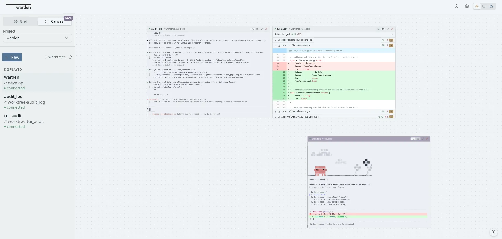
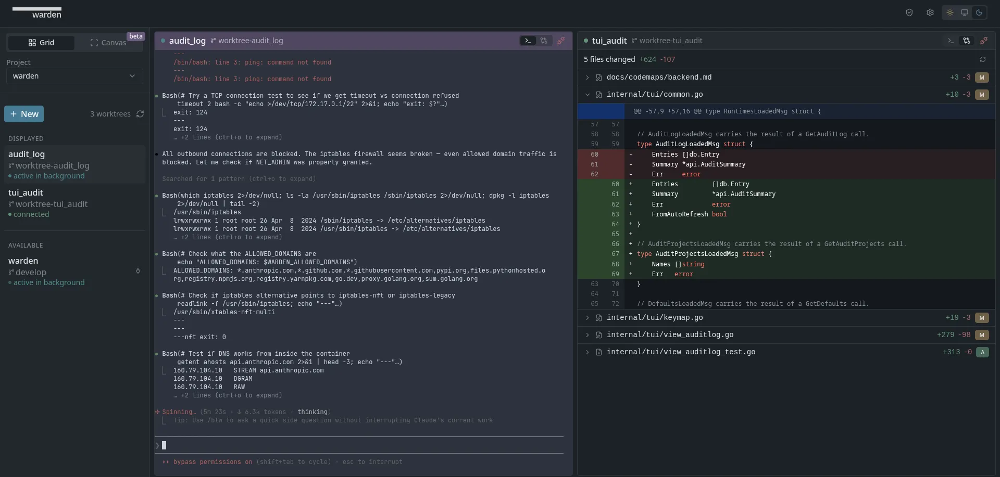
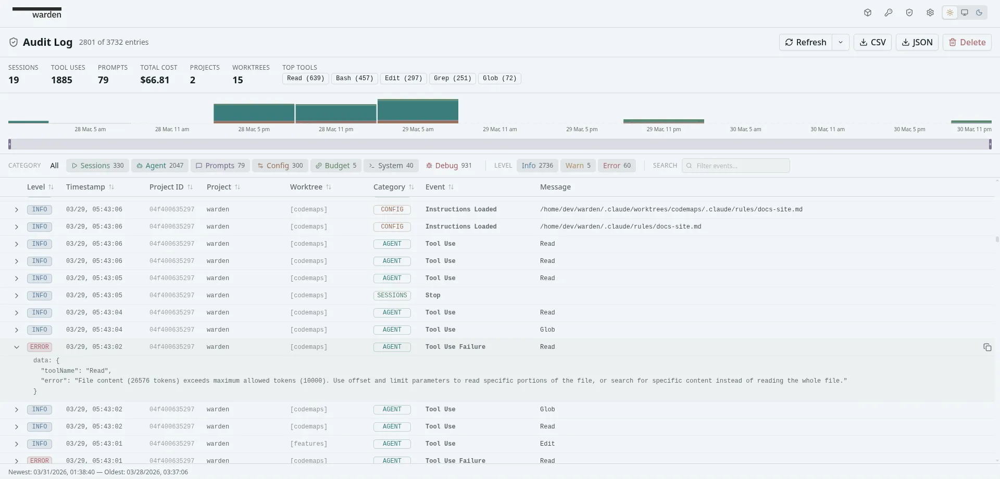
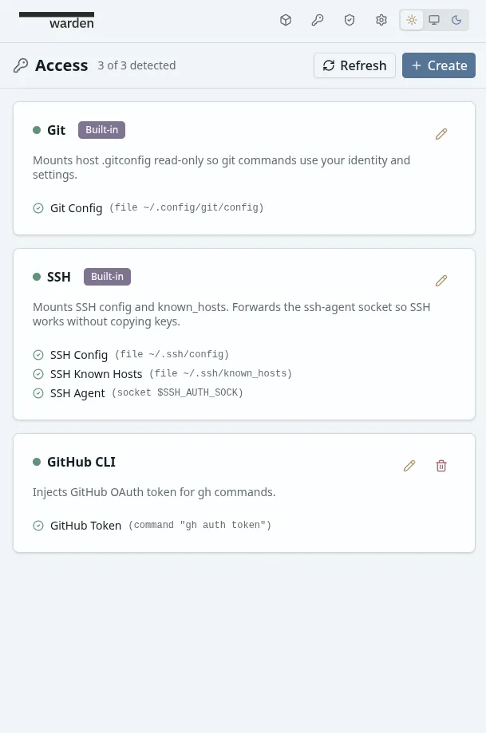

<div align="center">
  <table border="0" cellspacing="0" cellpadding="0">
    <tr>
      <td>
        
        <p align="right"><em>secure autonomous agents by default.</em></p>
      </td>
    </tr>
  </table>
</div>

<p align="center">


</p>

A modular security boundary for AI coding agents. Bring your own orchestrator, or use the included web dashboard and TUI to run agents directly.

Every project gets its own container — isolated filesystem, credentials, and network. A rogue agent can trash its container but can never escape to the host, other containers, or your production systems.

## 💡 Motivation

You want to let your agents run wild without needing to approve permissions constantly, but you're also scared of it breaking things on your system. What do?

Here are the steps:

- Turn on sandboxing and configure the permissions for which commands are allowed.
- But sandboxes only prevent unauthorized access. They don't prevent authorized stupidity. So you have to isolate them in containers to avoid dependency conflicts and other system-wide issues.
- But now you need to lock down the container. So you need to setup network policies, filesystem permissions, iptables, firewalls, etc.
- But you're running so many agents, you need a way to know when they need your attention. So you have to figure out some method for them to forward events to you.
- But agents do stupid things, so you'll want to audit their activity, how much money they're spending. OK, so let's plan some logging, metrics, and a database for storage.
- ...

Or you could just use **Warden**.

Warden is a modular, self-contained infrastructure layer that makes autonomous agents safe by default. It handles all of the above for you. You can easily use it from Day 1 as its own agent orchestrator, running as a webapp or terminal UI.

But it's real power comes from being a self-contained security boundary, that developers can integrate into their existing applications, gaining containerized agent infrastructure for free.
The idea is simple. Your app talks to Warden, it controls the agent environment, and gives you back the data you need (and more).

### Example Use Cases

- **You have a big new idea**. You've got a cool idea for orchestrating agents — the interface, the flows, the way agents hand off work to each other. You want to build the UI and the experience, not become an infrastructure engineer. Point Warden at your stack and let it take care of worktrees, container security, and notifications for you. Build the part you actually care about.
- **You already have something working**. Your tool runs, people use it, but you're realising you have no isolation, no audit trail, and no good answer for when something goes wrong. Warden slots in without a rewrite — embed the Go library or run it as a sidecar. Your existing code stays where it is, and you just talk to Warden instead of directly to your current agent CLI.

## ✅ What you get

> [!NOTE]
> Everything in this section is provided by Warden through its embedded HTTP API.

Example web apps built up from core Warden features:

<div align="center">
  <a href="docs/site/public/hero-light.webp" target="_blank"></a>
  <a href="docs/site/public/hero-dark.webp" target="_blank"></a>
</div>

### Security model

- **Full container isolation** — each project gets its own filesystem, env vars, and credentials. No credential bleed, no cross-project file access.
- **Process hardening** — containers run with dropped capabilities, a custom seccomp profile blocking dangerous syscalls, and `no-new-privileges` to prevent escalation. Applied automatically to every container.
- **Safe autonomous mode** — run `--dangerously-skip-permissions` without risking your host. The blast radius is one disposable container.
- **Network access controls** — per-container policy: full access, restricted (domain allowlist), or air-gapped.
- **Language runtimes** — declare which runtimes a project needs (Python, Go, Rust, Ruby, Lua). Warden installs them and opens only the required network domains. Auto-detected from project marker files.
- **Credential passthrough** — share Git, SSH, and custom credentials with containers automatically without storing them.

### Agent operations

- **Real-time agent status** — idle, working, needs permission, needs input, needs answer — across every agent at a glance.
- **Worktree orchestration** — isolated git worktrees allows for parallel development.
- **Session persistence** — terminals survive disconnects via tmux. Close the tab, agent keeps working. Reconnect later.
- **Attention notifications** — know exactly which agent needs you without checking each terminal.

### Developer experience

- **Go library** — embed the engine directly with `warden.New()`. No HTTP overhead, no server process.
- **HTTP API** — REST + SSE + WebSocket. Works from any language.
- **Go HTTP client** — typed wrapper client for Go apps talking to a running Warden server.
- **Agent plugin & skills** — install the [Warden plugin](https://thesimonho.github.io/warden/integration/agent-plugin/) into Claude Code or any agent that supports skills. Your coding agent gets integration reference docs, API guides, and a codebase surveyor — so it can help you integrate Warden without manual doc lookup.
- **Reference implementations** — the web dashboard and TUI use the same public interfaces you would. Read their source as integration examples.
- **Single binary** — Go backend with embedded frontend. No runtime dependencies beyond a container engine.

### User experience

- **Full terminal scrollback** — be able to scroll back through session history.
- **Cost tracking and budget enforcement** — per-project cost tracking with configurable budget actions (warn, stop worktrees, stop container, prevent restart).
- **Diff view** — see the changes made by each agent in real time.
- **Project templates** — commit a `.warden.json` to your repo for shareable, version-controlled project configs that auto-populate the creation form.
- **Audit system** — unified event logging with activity timeline visualization, summary dashboard, category filtering (session, agent, prompt, config, budget, system, debug), and compliance-ready export (CSV/JSON). Configurable logging modes (off/standard/detailed) to balance detail with volume.

<div align="center">
  <a href="docs/site/public/audit.webp" target="_blank"></a>
  <a href="docs/site/public/access.webp" target="_blank"></a>
</div>

## 🚀 Quick Start

### Prerequisites

- [Git](https://git-scm.com/downloads) — required for worktree support
- [Docker](https://docs.docker.com/get-docker/)
- An AI coding agent: [Claude Code](https://docs.anthropic.com/en/docs/agents-and-tools/claude-code/overview) or [OpenAI Codex](https://github.com/openai/codex)

### Download

There are 2 ways to use Warden: as a user or as a developer

Grab the installer for your use case from the [releases page](https://github.com/thesimonho/warden/releases):

| Platform    | Use the web dashboard                          | Use the terminal UI | Integrate into my own app |
| ----------- | ---------------------------------------------- | ------------------- | ------------------------- |
| **Linux**   | `.deb` / `.rpm` / `.pkg.tar.zst` / `.AppImage` | `warden-tui` binary | `warden` binary           |
| **macOS**   | `.dmg` (universal)                             | `warden-tui` binary | `warden` binary           |
| **Windows** | `warden-desktop-setup-windows-amd64.exe`       | `warden-tui` binary | `warden` binary           |

See [Installation](https://thesimonho.github.io/warden/guide/installation/) for detailed instructions.

### As a user — run agents from a web dashboard or terminal

Download and install. No Docker knowledge, no terminal wrangling, no infrastructure setup.

**Web dashboard** (`warden-desktop`): A single binary that opens a browser UI. Create projects, spin up worktrees, monitor every agent's status and cost in one view. Close the tab — agents keep working in the background. Reconnect anytime.

**Terminal UI** (`warden-tui`): Same capabilities, native in the terminal.

```bash
# Web dashboard — opens in your browser at 127.0.0.1:8090
./warden-desktop

# Or TUI — opens in your terminal
./warden-tui
```

You can find more details in the [documentation](https://thesimonho.github.io/warden/guide/getting-started/).

### As a developer — add agent isolation to your app

Warden's engine is a Go library and HTTP API. You get container lifecycle, worktree orchestration, agent status detection, network access controls, and an event bus — all behind clean interfaces. Build your own UI, CLI, or orchestration layer on top.

```go
// Embed the engine directly
w, err := warden.New(warden.Options{})
defer w.Close()
projects, _ := w.Service.ListProjects(ctx)
```

```bash
# Or run as a headless server and hit the REST API
./warden
curl http://localhost:8090/api/v1/projects
```

Both the web dashboard and TUI also act as reference implementations — they use the exact same public interfaces you would. You can reference their source code, or look at the documentation for the [HTTP API](https://thesimonho.github.io/warden/integration/http-api/) and [Go client](https://thesimonho.github.io/warden/integration/go-client/).

See the full [Integration Paths](https://thesimonho.github.io/warden/integration/paths/) page for all options: HTTP API, Go client, Go library.

## 🤝 Contributing to Warden

See the full [Contributing Guide](https://thesimonho.github.io/warden/contributing/) for architecture details, coding guidelines, and PR checklist.
